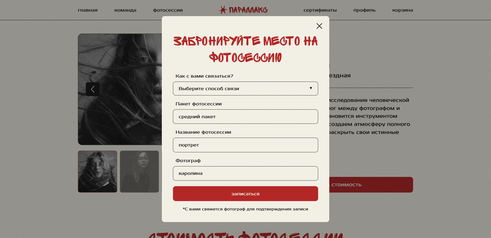
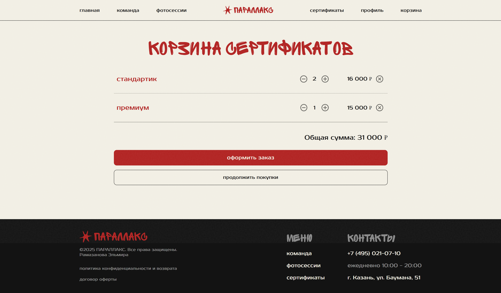
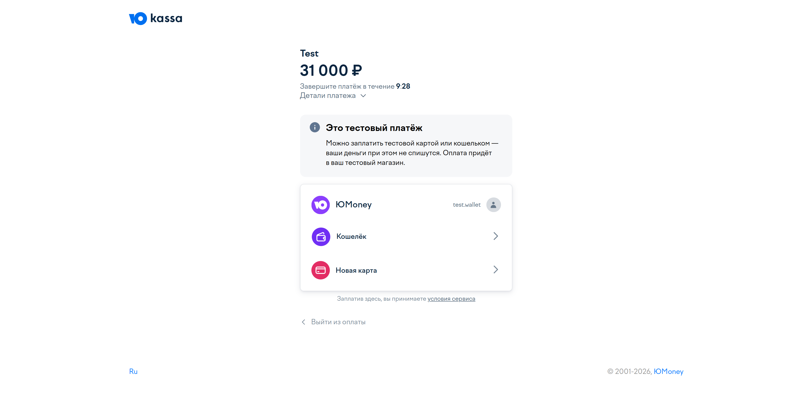
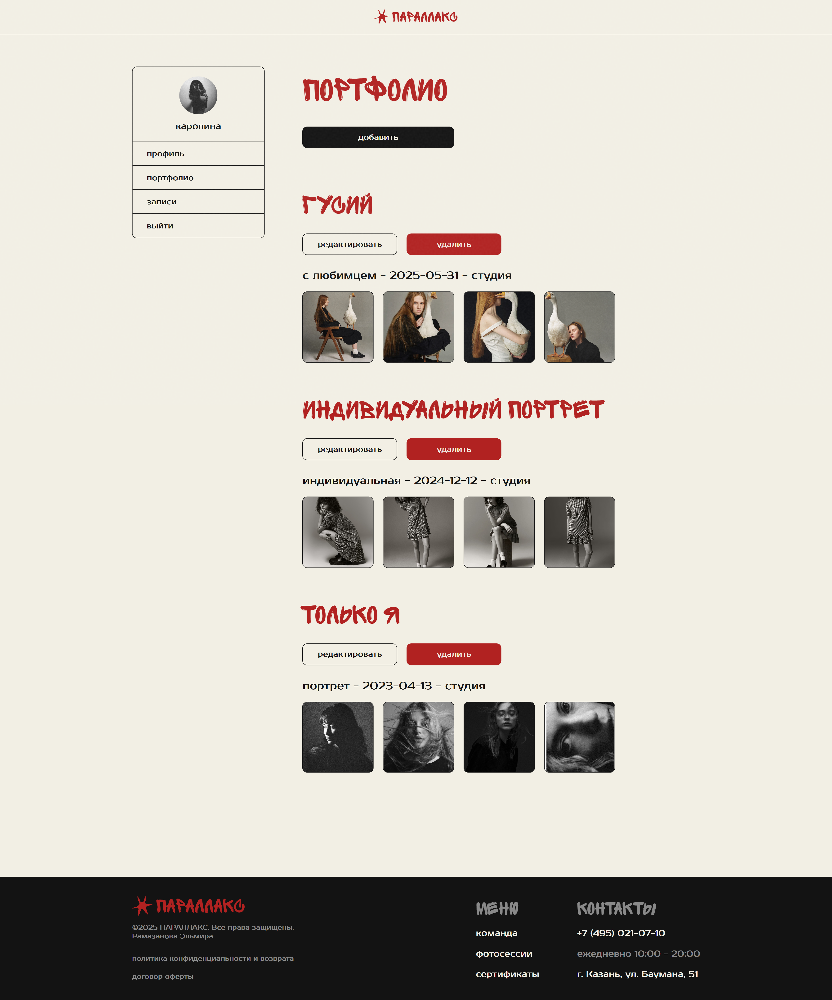
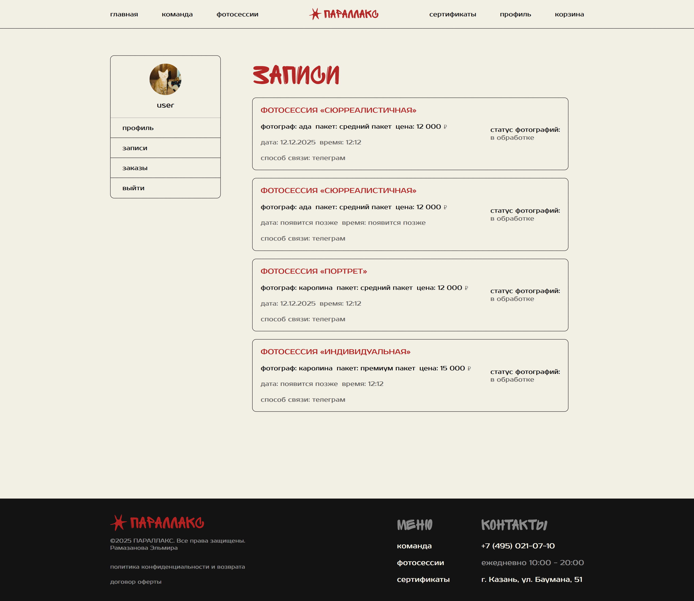

# Сайт фотостудии «Параллакс»

> **Полноценный веб-сайт для фотостудии с системой бронирования, интеграцией с ЮKassa и многоролевой системой.**

## Галерея проекта

### Основные страницы

| Главная страница | Каталог услуг | Команда фотографов |
|------------------|---------------|-------------------|
|  |  |  |

---

### Функционал бронирования и оплаты

| Страница фотосессии (с модалкой) | Корзина | Оплата через ЮKassa |
|----------------------------------|---------|---------------------|
|  |  |  |

---

### Личные кабинеты

| Кабинет фотографа (портфолио) | Кабинет администратора | Кабинет пользователя
|-------------------------------|------------------------|------------------------|
|  |  |  |

---

## О проекте

«Параллакс» - это комплексный сайт, разработанный с нуля. Проект решает задачи онлайн-презентации услуг, управления бронированиями и продажи сертификатов.

**Ключевые возможности:**
- **Информационный сайт:** Главная страница с портфолио, услугами и контактами.
- **Система заявок:** Форма для бронирования фотосессии (данные сохраняются в БД).
- **Покупка сертификатов:** Добавление в корзину с тестовой оплатой через ЮKassa (данные сохраняются в БД).
- **Портфолио:** Визуальное представление работ студии и отдельных фотографов.
- **Многоролевая система:** Личные кабинеты пользователя, фотографа и администратора.
- **Адаптивная верстка:** Корректное отображение на всех устройствах.

---

## Стек технологий

| Категория       | Технологии                                                                 |
|-----------------|----------------------------------------------------------------------------|
| **Бэкенд**      | Нативный PHP (без фреймворков), MySQL                                       |
| **Фронтенд**    | HTML5, CSS3, JavaScript (ES6)                                              |
| **Архитектура** | Компонентный подход (разделение на `components` и `pages`) для переиспользования кода |
| **Сервер**      | OpenServer (локальное размещение)|

---

## Структура проекта

Проект организован для простоты поддержки и масштабирования:

- **`/assets`** - Статические файлы: изображения, CSS, JS-скрипты.
- **`/components`** - Переиспользуемые части сайта: шапка, подвал, формы, карточки товаров.
- **`/pages`** - Основные страницы приложения (контакты, услуги и т.д.).
- **`index.php`** - Главная страница сайта.

---

## Быстрый старт (для локального развертывания)

```bash
# 1. Клонируйте репозиторий
git clone https://github.com/raavushkka/parallax.git

# 2. Разместите папку проекта в корне вашего веб-сервера
#    Для OpenServer: поместите папку parallax в папку domains/
#    Для XAMPP: поместите папку parallax в папку htdocs/

# 3. Настройте подключение к базе данных
#    Создайте базу данных MySQL (например, с именем parallax)
#    Настройте параметры подключения в вашем файле конфигурации БД
#    (обычно это config/database.php или отдельный файл с настройками)

# 4. Откройте проект в браузере
#    Для OpenServer: http://parallax.local
#    Для XAMPP: http://localhost/parallax
```

> **Важно:** Для полной работы проекта необходима структура базы данных. Если вы хотите развернуть проект с тестовыми данными, запросите у меня SQL-дамп - я предоставлю структуру таблиц и демо-наполнение.

---

**Моя роль в проекте**
- Аналитика и дизайн: Проектирование пользовательских сценариев, UI/UX дизайн.
- Full-stack разработка: Создание фронтенд- и бэкенд-частей, интеграция API платежной системы ЮKassa.
- Работа с данными: Проектирование структуры БД, написание сложных SQL-запросов.


